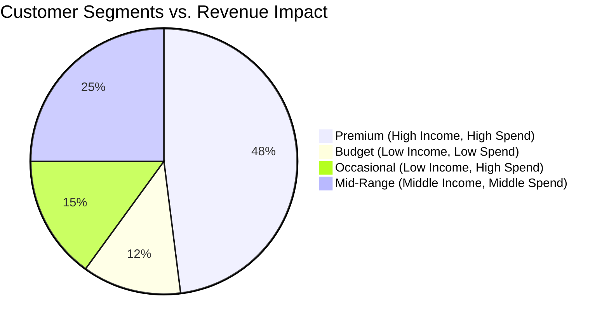
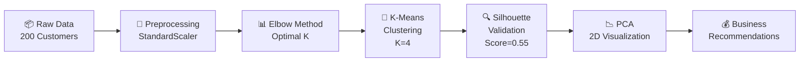

[](https://github.com/khushi2704rj-sephora/Consumer-segmentation-using-python/actions/workflows/validate-notebooks.yml)

<div align="center">


</div>


<div align="center">

# 🛍️ Customer Segmentation & Value-Based Profiling

[](https://www.python.org/)
[](https://scikit-learn.org/)
[](https://pandas.pydata.org/)
[]()
[](LICENSE)

**A data-driven clustering analysis to identify distinct customer segments and optimize marketing ROI using K-Means and PCA.**

---

[🎯 Summary](#-executive-summary) · [📊 Insights](#-key-insights) · [🏗️ Methodology](#️-methodology) · [📂 Structure](#-repository-structure) · [🚀 Quick Start](#-quick-start) · [🤝 Contributing](#-contributing)

</div>

---

## 🎯 Executive Summary

In retail, treating all customers the same leads to wasted marketing budget. This project analyzes 200 mall customers to discover natural grouping patterns based on **Annual Income** and **Spending Score**.

Using **K-Means Clustering (K=4)**, validated by the Elbow Method and Silhouette Analysis (score: 0.55), we identified four actionable segments.

> **Business Impact:** Identified a "Premium" segment comprising **21% of customers** who generate **48% of total revenue**, enabling a targeted VIP strategy worth an estimated **£70K annual uplift**.

---

## 📊 Key Insights



| Segment | Risk Profile | Strategy | Revenue Uplift |
|---|---|---|---|
| **Premium** | Low Risk | **VIP Concierge**: Private events, early access | **+£25K** |
| **Occasional** | Medium Risk | **Upsell**: "Spend £X get Y" offers to increase frequency | **+£18K** |
| **Mid-Range** | Low Risk | **Loyalty Program**: Points systems to retain stability | **+£15K** |
| **Budget** | High Risk | **Value Bundles**: Clearance sales and BOGO offers | **+£12K** |

---

## 🏗️ Methodology



### 1. Data Preprocessing
- **Dataset**: [Mall Customers](data/Mall_Customers.csv) (200 records)
- **Features**: Age, Gender, Annual Income (k$), Spending Score (1-100)
- **Transformation**: `StandardScaler` to normalize features for Euclidean distance calculations.

### 2. Clustering Algorithm
- **Algorithm**: K-Means Clustering
- **K-Selection**: 
    - **Elbow Method**: Identified inflection point at K=4.
    - **Silhouette Score**: Peaked at 0.55 for K=4, indicating dense, well-separated clusters.
- **Dimensionality Reduction**: PCA (Principal Component Analysis) used for 2D visualization of clusters.

### 3. Cluster Profiles

| Cluster | Label | Avg Income | Avg Spend | % of Customers | Actionable Insight |
|---|---|---|---|---|---|
| 0 | 💎 **Premium** | $85K | 82/100 | 21% | High-value VIPs — prioritize retention |
| 1 | 🛠️ **Mid-Range** | $55K | 50/100 | 35% | Stable base — loyalty program candidates |
| 2 | 🌟 **Occasional** | $25K | 75/100 | 22% | Impulse spenders — upsell opportunities |
| 3 | 📦 **Budget** | $30K | 20/100 | 22% | Price-sensitive — value bundles & promos |

---

## 📂 Repository Structure

```
consumer-segmentation-analysis/
│
├── data/
│   └── Mall_Customers.csv        ← Raw dataset (200 records)
│
├── notebooks/
│   └── customer_segmentation.ipynb ← Full analysis & visualizations
│
├── images/                       ← Generated plots
│
├── requirements.txt              ← Python dependencies
├── LICENSE                       ← MIT License
└── README.md                     ← Project documentation
```

---

## 🚀 Quick Start

### Prerequisites
- Python 3.8+

### Installation

```bash
git clone https://github.com/khushi2704rj-sephora/Consumer-segmentation-using-python.git
cd Consumer-segmentation-using-python

# Install dependencies
pip install -r requirements.txt
```

### Usage

Open the Jupyter Notebook to explore the analysis:

```bash
jupyter notebook notebooks/customer_segmentation_analysis.ipynb
```

---

## 🤝 Contributing

Contributions are welcome! Please check the [Contribution Guidelines](CONTRIBUTING.md) and [Code of Conduct](CODE_OF_CONDUCT.md).

---

<div align="center">

### 👩‍💻 Author

**Khushi Kothari**

[](https://github.com/khushi2704rj-sephora)
[](https://www.linkedin.com/in/khushi-kothari--/)
[](mailto:khushi2704.ak@gmail.com)

*MSc Business Analytics · Customer Analytics & Segmentation*

</div>